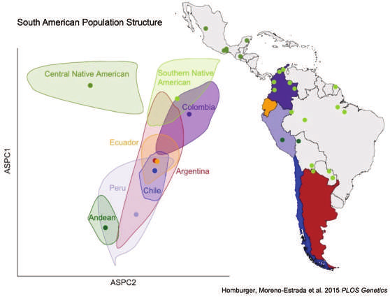

::: {.hero}
# A pangenome for Latin America

[Most genomic data is still mapped to a reference built from a handful of people. We are sequencing 1,000 long-read genomes from Indigenous and admixed ancestries across Latin America to find the structural variation that reference misses, and to learn what it does in immune cells and in gallbladder cancer.]{.lede}

::: {.actions}
[Read the research plan](research.qmd){.btn .btn-primary}
[Browse the cohorts](cohorts.qmd){.btn .btn-outline-primary}
:::
:::

```{=html}
<div class="band-wrap" role="img" aria-label="1,000 genomes to be sequenced, by country: Mexico 220, Chile 165, Brazil 136, Peru 135, Colombia 90, Argentina 80, Uruguay 74, United States 50, Costa Rica 50.">
  <div class="band-caption">1,000 genomes to be sequenced, drawn to scale by country, north to south</div>
  <div class="band">
    <div class="seg" style="flex:50;background:var(--c-usa)" title="United States: 50"></div>
    <div class="seg" style="flex:220;background:var(--c-mexico)" title="Mexico: 220"></div>
    <div class="seg" style="flex:50;background:var(--c-costarica)" title="Costa Rica: 50"></div>
    <div class="seg" style="flex:90;background:var(--c-colombia)" title="Colombia: 90"></div>
    <div class="seg" style="flex:135;background:var(--c-peru)" title="Peru: 135"></div>
    <div class="seg" style="flex:136;background:var(--c-brazil)" title="Brazil: 136"></div>
    <div class="seg" style="flex:74;background:var(--c-uruguay)" title="Uruguay: 74"></div>
    <div class="seg" style="flex:165;background:var(--c-chile)" title="Chile: 165"></div>
    <div class="seg" style="flex:80;background:var(--c-argentina)" title="Argentina: 80"></div>
  </div>
  <div class="band-key" aria-hidden="true">
    <span style="--k:var(--c-usa)">United States <b>50</b></span>
    <span style="--k:var(--c-mexico)">Mexico <b>220</b></span>
    <span style="--k:var(--c-costarica)">Costa Rica <b>50</b></span>
    <span style="--k:var(--c-colombia)">Colombia <b>90</b></span>
    <span style="--k:var(--c-peru)">Peru <b>135</b></span>
    <span style="--k:var(--c-brazil)">Brazil <b>136</b></span>
    <span style="--k:var(--c-uruguay)">Uruguay <b>74</b></span>
    <span style="--k:var(--c-chile)">Chile <b>165</b></span>
    <span style="--k:var(--c-argentina)">Argentina <b>80</b></span>
  </div>
</div>
```

## From maps to medicine

The project follows the International Common Disease Alliance's path from **Maps** to **Mechanisms** to **Medicine**. Each aim feeds the next.

```{=html}
<div class="m2m">
  <div class="stage">
    <div class="aim">Aim 1</div>
    <h3>Maps</h3>
    <p>Build a graph-based Latin American pangenome from 1,000 PacBio HiFi genomes at 30× and catalog the structural variants absent from the current reference.</p>
    <a class="more" href="research.qmd#maps">About the pangenome</a>
  </div>
  <div class="stage">
    <div class="aim">Aim 2</div>
    <h3>Mechanisms</h3>
    <p>Map how structural variants change gene expression in 29 cell types, using single-cell RNA from 520 of the same people.</p>
    <a class="more" href="research.qmd#mechanisms">About SV-eQTL mapping</a>
  </div>
  <div class="stage">
    <div class="aim">Aim 3</div>
    <h3>Medicine</h3>
    <p>Study germline and somatic structural variants in gallbladder cancer among Chilean patients of Mapuche ancestry, the population with the highest burden worldwide.</p>
    <a class="more" href="research.qmd#medicine">About the gallbladder study</a>
  </div>
</div>
<div class="foundation">
  <h3>Aim 4: Local capacity, local leadership</h3>
  <p>Sequencing, analysis and data stewardship happen in Latin America, with yearly hands-on workshops run with CABANAnet. <a href="training.qmd">Training and community</a></p>
</div>
```

## The consortium in numbers

```{=html}
<div class="facts">
  <div><strong>50,000+</strong><span>DNA samples available across member cohorts</span></div>
  <div><strong>18</strong><span>cohorts contributing samples</span></div>
  <div><strong>9</strong><span>countries with contributing cohorts</span></div>
  <div><strong>30+</strong><span>researchers, a 100% Latin American team</span></div>
</div>
```

## Why this matters

Populations of the Americas carry alleles found nowhere else, some with clear medical consequences. Yet the Human Pangenome Reference Consortium currently includes no reference population of Indigenous American ancestry, and Latin American populations are strongly substructured. Without a regional reference, the variation that drives health differences across the region stays invisible.

{fig-alt="PCA plot with ellipses for Central Native American, Southern Native American, Andean and admixed populations from Colombia, Ecuador, Peru, Chile and Argentina, next to a map of South America." width="85%"}

## Latest news

::: {#latest-news}
:::

[All news and updates](news/index.qmd)
