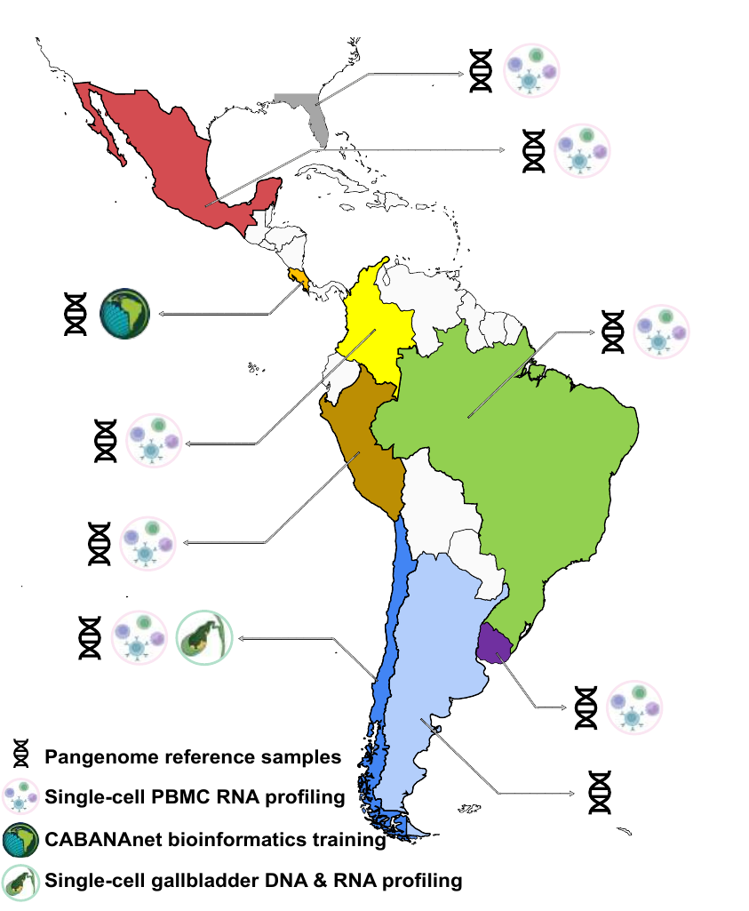
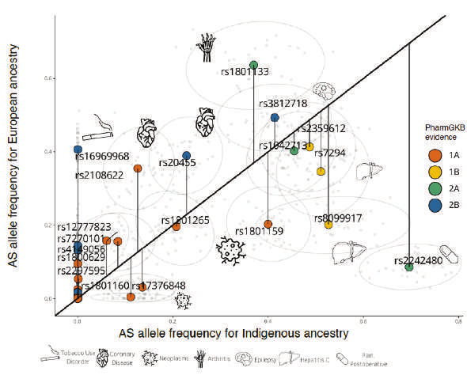
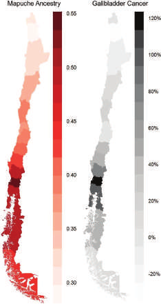

The human reference genome was assembled from very few people, so a large share of human variation is still missing from it. The Telomere-to-Telomere consortium and the Human Pangenome Reference Consortium have shown what long reads can recover, but many ancestries remain unrepresented, including every Indigenous American population. LatinGenomes brings together existing, consented DNA collections from across the region to close that gap.

The program builds on resources already being generated at no cost to this grant: long-read sequencing funded by PacBio, and single-cell RNA profiles of 500+ PBMC samples and healthy gallbladder tissue from the CZI-funded [LatinCells](https://www.latincells.org) project.

{fig-alt="Map of the Americas with Mexico, Costa Rica, Colombia, Peru, Brazil, Chile, Uruguay, Argentina and part of the United States highlighted in distinct colors, with icons for each site's contribution." width="70%" fig-align="center"}

## Aim 1: A Latin American pangenome {#maps}

We will select 1,000 reference samples representing the major ancestral components of the Americas, prioritizing individuals with the highest proportions of Indigenous ancestry based on existing SNP-array data. Each will be sequenced with PacBio HiFi at 30× coverage.

Every genome gets a *de novo* assembly, avoiding reference bias. Assemblies are error-corrected, aligned in a multiple whole-genome alignment, and represented as a graph, from which structural variants (deletions, duplications, inversions, insertions and translocations) are called with tools such as the `vg` toolkit. Variants are annotated against known SV databases, compared with the current reference, and compared between Indigenous ancestries within the region.

**Outputs:** the LatinPangenome graph, a catalog of structural variants segregating in Latin America, and a better reference for mapping WGS data from Latin American populations anywhere.

{fig-alt="Scatter plot of allele frequency in Indigenous ancestry versus European ancestry for pharmacogenomic SNPs, colored by PharmGKB evidence level." width="80%" fig-align="center"}

## Aim 2: How structural variants shape gene expression {#mechanisms}

Structural variants appear to have outsized effects on gene expression, yet SV-eQTL studies so far rely on short reads, bulk tissue and mostly European cohorts. Only 17% of GTEx v8 individuals are of non-European or admixed ancestry.

We will combine high-confidence SVs from 520+ long-read genomes with single-cell RNA from the same individuals, spanning 10 Indigenous communities in 6 countries plus admixed populations. Using 29 cell types (20 immune, 9 gallbladder), we will:

1. map cis-eQTLs jointly for SNVs, indels and SVs (MAF ≥ 0.05) with a permutation-based approach, controlling for population structure;
2. fine-map causal variants within 1 Mb windows with CAVIAR and measure the share of eQTLs led by an SV;
3. meta-analyze SV-eQTL activity across cell types to find cell-type-specific effects at the resolution of T, B and NK subtypes.

{fig-alt="Two UMAP plots of immune cell types and a bar chart of differentially expressed genes per cell subtype." width="85%" fig-align="center"}

## Aim 3: Gallbladder cancer in Mapuche ancestry {#medicine}

Chile reports the highest gallbladder cancer incidence worldwide, and its Mapuche population is the most affected, particularly women. Each 1% increase in Mapuche ancestry among admixed Chileans has been associated with a 3.7% increase in gallbladder cancer mortality risk.

:::: {.columns}
::: {.column width="62%"}
**Germline SVs.** We will map SV-eQTLs in 122 individuals (77 healthy donors from Aim 2 and 45 newly recruited cases), identify eGenes differentially expressed in tumor cell types, and test colocalization with published gallbladder cancer GWAS signals.

**Somatic SVs at single-cell resolution.** Strand-seq with scNOVA on 1,000 tumor cells from 10 Mapuche patients will catalog deletions, inversions, duplications and chromothripsis, and infer their effect on expression from nucleosome occupancy. Optical genome mapping of bulk tumor DNA from 45 patients will add smaller SVs that Strand-seq cannot resolve.
:::
::: {.column width="38%"}
{fig-alt="Two maps of Chile: estimated Mapuche ancestry proportions in red and gallbladder cancer mortality in gray, both highest in the south-central regions."}
:::
::::

## Aim 4: Local capacity {#capacity}

Helicopter research, thin infrastructure and short funding cycles have held back large-scale genomics in Latin America. This team is entirely Latin American, and the work is distributed so that capacity stays in the region: sequencing and SV discovery across the Broad Institute, Mexico and Uruguay; pangenome curation and storage in Uruguay; single-cell integration in Mexico; patient recruitment and gallbladder profiling in Chile. See [Training](training.qmd) and [Timeline](timeline.qmd).
